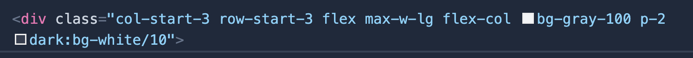

далее
<a href="08.md">
Техническая часть (JIT compiler)
</a>

<h1>Техническая часть (Quick Start)</h1>

Основной прикладной инструментарий Tailwind состоит из библиотеки классов которые можно использовать в HTML-разметке. Тут ничего принципиально нового нет. Начнем с него, а далее рассмотрим иные аспекты.

После подключения к проекту классы доступны в любом компоненте и дополнительной конфигурации(внутри компонента) не требуется.

Для сравнения опишем сценарий по которому действует разработчик как правило (без Tailwind).

<ul>
<li>
Создает файл со стилями
</li>
<li>
Тем или иным способом подключает его в HTML-разметку компонента
</li>
<li>
Создает класс (иной селектор) создает по возможности релевантное имя
</li>
<li>
Продумаывает нет ли необходимых ему стилей в уже имеющихся стилях(глобальных или локальных)
</li>
<li>
Описывает стили в созданном классе, в идиале следя за релевантностью имени селектора и содержания
</li>
<li>
Навешивает класс на элемент
</li>
</ul>

При том описанный сценарий самый простой. Ряд существенных ньюансов выползает при попытке вносить изменения в уже имеющиеся стили, следить за тем чтобы они не лежали мертвым грузом и не конфликтовали с другими стилями.

 

В случае с Tailwind все это сводится к одному пункту: навешиванию классов на элемент.
Плюс на начальном этапе ознокомлению с документацией, но как показывает практика, большинство используемых стилей повторяются от элемента к элементу и запоминаются очень быстро, большую помощь в этом оказывает описанный ранее плагин для VSCode.

 

Названия большинства классов интуитивно понятны и даже предсказуемы. Как например: <code>text-center</code>, <code>bg-red-500</code>, <code>font-serif</code>, <code>flex</code> и т.д.

Наиболее часто используемые стили как width, heigth, margin, padding представлены в виде псевдонимов из соответсвующей буквы (w, h, m, p).

