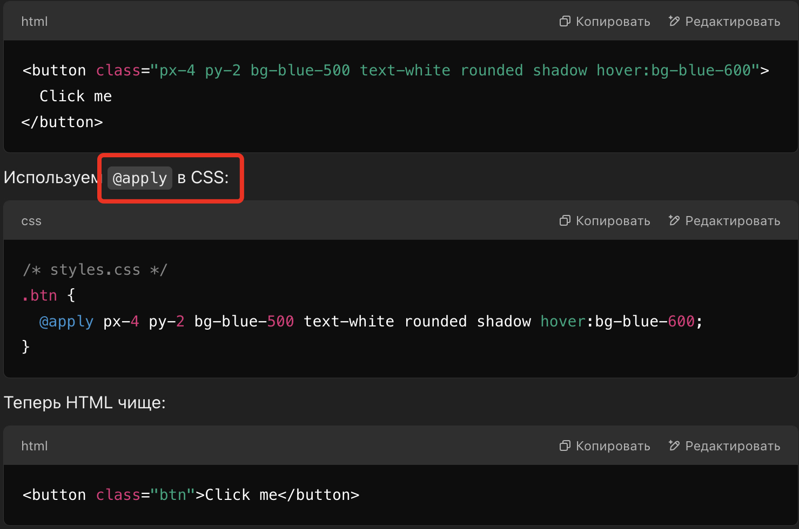

<h1>Слабые стороны Tailwind</h1>

К основным недостаткам Tailwind можно отнести нарушение принципа разделения ответственности. Фактически стили и разметка находяться в одном месте. 
В результате, если необходимо внести изменения в стили, то придется искать их в коде.
Что требует определнного навыка (привычки работы с tailwind). 

 

Есть инстурменты, которые позволяют избавиться от этого недостатка.
Например, <code> @apply </code>. Но тут получается замкнутый круг, потомучто мы опять же используем классы css в классическом стиле.

 

Кроме того TW это все таки набор классов которые необходимо запоминать.
Сконструированы они очень логично и интуитивно понятно (margin-left - ml, text-xs и пр), помогает и встроенный плагин в VS Code. Но все таки есть определенный временной 
промежуток который необходимо потратить на изучение. Что впрочем являвется общим принципом отоносящимся к любому новому инструменту.

